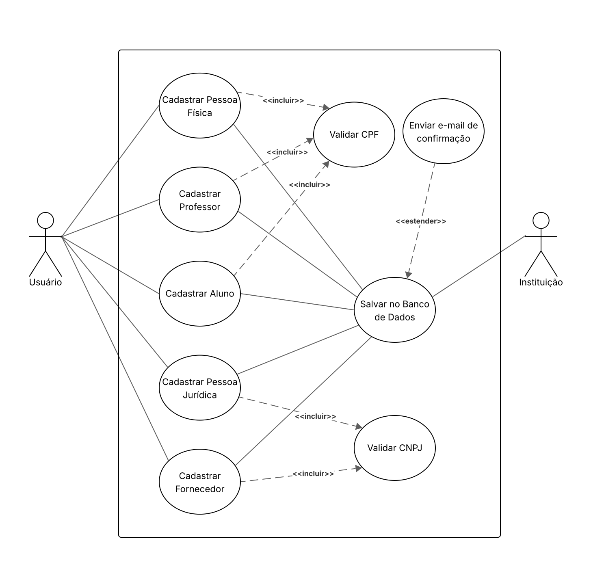
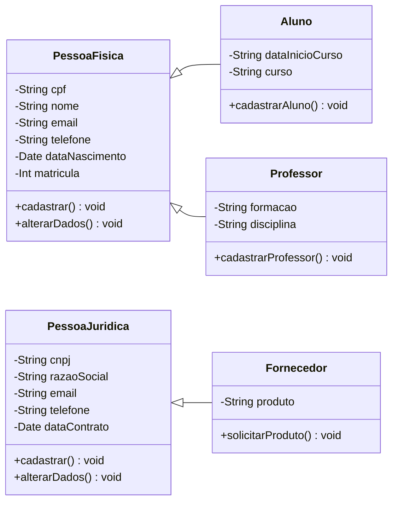

  

```mermaid
classDiagram
    class PessoaFisica {
        -String cpf
        -String nome
        -String email
        -String telefone
        -Date dataNascimento
        -Int matricula
        +cadastrar() void
        +alterarDados() void
    }

    class Aluno {
        -String dataInicioCurso
        -String curso
        +cadastrarAluno() void
    }

    class Professor {
        -String formacao
        -String disciplina
        +cadastrarProfessor() void
    }

    class PessoaJuridica {
        -String cnpj
        -String razaoSocial
        -String email
        -String telefone
        -Date dataContrato
        +cadastrar() void
        +alterarDados() void
    }

    class Fornecedor {
        -String produto
        +solicitarProduto() void
    }

    Aluno --|> PessoaFisica
    Professor --|> PessoaFisica
    Fornecedor --|> PessoaJuridica
class PessoaFisica
  direction RL
```
