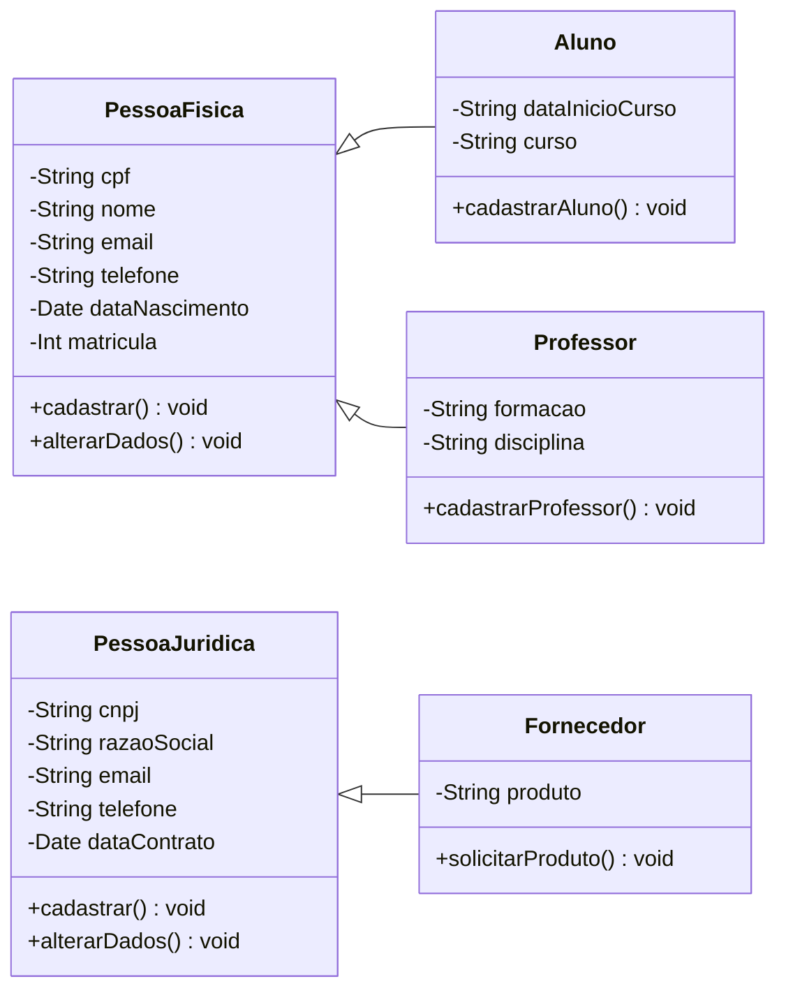

# 
Centro Universitário Senac

## 
Curso de Tecnologia em Análise e Desenvolvimento de Sistemas

### 
PROJETO INTEGRADOR: DESENVOLVIMENTO DE SISTEMAS ORIENTADO A OBJETOS

---
#### Colaboradores:
- [Airon]
- [Anderson]
- [Alexandre](https://github.com/AlexandreGarciaJr)
- [Guilherme](https://github.com/gmcasagrande)
- [Gustavo]
- [Maycon]
- [Pâmela]

Este trabalho consiste no processo de modelagem de um sistema Orientado a Objetos, voltado a gestão de dados de uma grande universidade.

Modelagem foi feita utilizando os conhecimentos sobre UML que foram adquiridos nas disciplinas do curso.

Os diagramas representam o cadastro de diferentes tipos de pessoas que vão interagir com esse sistema:

1) Desenvolvimento de um diagrama de caso de uso que represente os seguintes cenários:

Cadastro de Pessoa Física\
Cadastro de Pessoa Jurídica\
Cadastro de Professores\
Cadastro de Fornecedores\
Cadastro de Alunos

2) Descrição dos cenários dos casos de uso construídos;
  
3) Diagrama de classe que esteja de acordo com a proposta de projeto.

---
# 
Diagrama de caso de uso

  

# 
Diagrama de classe

