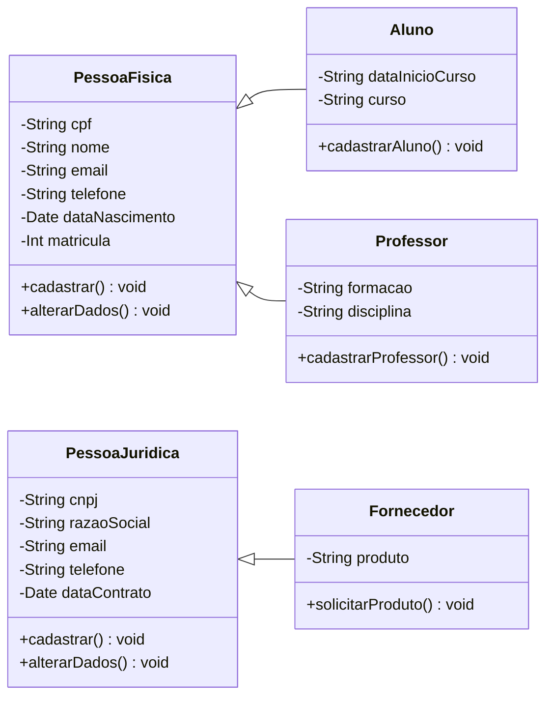

# 
Centro Universitário Senac

## 
Curso de Tecnologia em Análise e Desenvolvimento de Sistemas

### 
PROJETO INTEGRADOR: DESENVOLVIMENTO DE SISTEMAS ORIENTADO A OBJETOS

---

Este trabalho consiste no processo de modelagem de um sistema Orientado a Objetos, voltado a gestão de dados de uma grande universidade.

---
# 
Diagrama de caso de uso

  

# 
Diagrama de classe

#### Colaboradores:
- [Airon]
- [Anderson]
- [Alexandre](https://github.com/AlexandreGarciaJr)
- [Guilherme](https://github.com/gmcasagrande)
- [Gustavo]
- [Maycon]
- [Pâmela]
