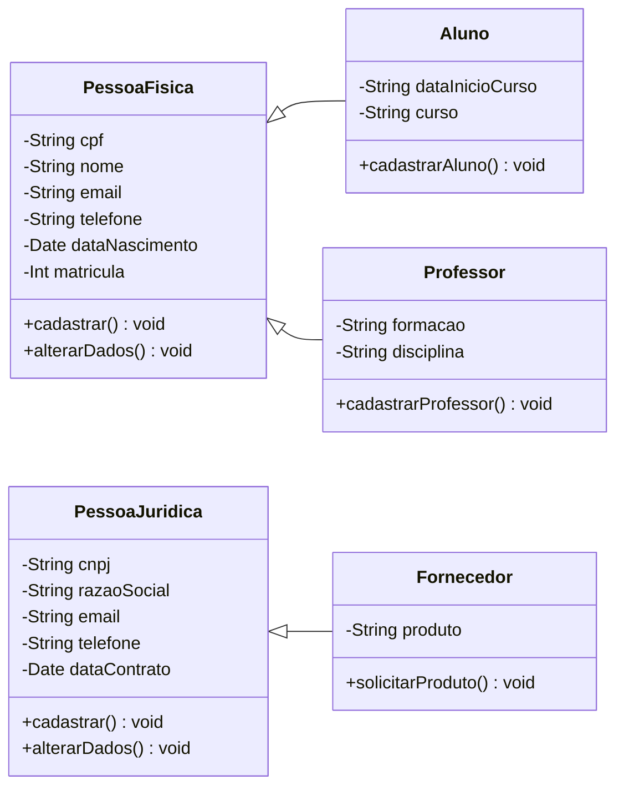

# 
Centro Universitário Senac

## 
Curso de Tecnologia em Análise e Desenvolvimento de Sistemas

### 
PROJETO INTEGRADOR: DESENVOLVIMENTO DE SISTEMAS ORIENTADO A OBJETOS

---

Este trabalho consiste no processo de modelagem de um sistema Orientado a Objetos, voltado a gestão de dados de uma grande universidade.

---
## 
Diagrama de caso de uso

  

## 
Diagrama de classe

---
## 👥 Colaboradores
<table>
  <tr>
    <td align="center">
      <a href="https://github.com/Pamelacimirro">
        
         
        <b>Pâmela</b>
      </a>
       
    </td>
      <td align="center">
      <a href="https://github.com/aironvalentim">
        
         
        <b>Airon</b>
      </a>
       
    </td>    <td align="center">
      <a href="https://github.com/AlexandreGarciaJr">
        
         
        <b>Alexandre</b>
      </a>
       
      </td>    <td align="center">
      <a href="https://github.com/usuario2">
        
         
        <b>Anderson</b>
      </a>
       
    </td>    <td align="center">
      <a href="https://github.com/gmcasagrande">
        
         
        <b>Guilherme</b>
      </a>
       
    </td>    <td align="center">
      <a href="https://github.com/usuario1">
        
         
        <b>Gustavo</b>
      </a>
       
    </td>    <td align="center">
      <a href="https://github.com/Maycon-on">
        
         
        <b>Maycon</b>
      </a>
       
    </td>
  </tr>
  <tr>
</table>
